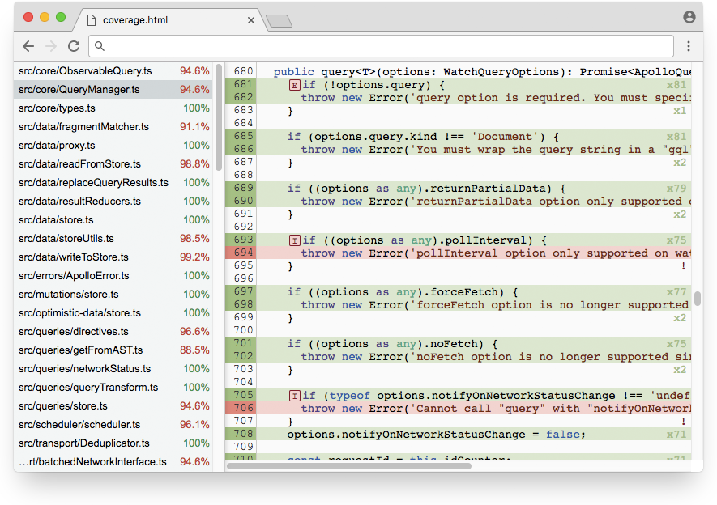

# TSCover - code coverage for TypeScript

TSCover is a Typescript compiler that produces instrumented javascript used to collect code coverage information. Code coverage is saved in the form of LCOV files, JSON files or as an HTML report.

### Features

- Works as a drop-in replacement for `tsc`. All `tsc` options work as expected.
- Instruments .ts files during compilation. Does not require .map files.
- Reports coverage as lcov.info, json files or as an html report.
- Supports statement, branch and file coverage.

### Usage

TSCover requires `typescript` library so first step is to make sure that typescript is installed globally. After that install `tscover` as the global library:

	npm install -g typescript
	npm install -g tscover

You can run `tscover` the same way that you would run `tsc`, all tsc options will work as expected. Or you can use tsconfig.json to specify compiler options:

	tscover program.ts
	tscover -p project/tsconfig.json

Run the program as you normally would and upon exit it will produce a `coverage` folder with lcov, json and html files in it.

### Instrumented files

Normally `tscover` produces compiled javascript files only. However if you would like to see instrumented typescript files too pass `--tscover-instrument` flag:

	tscover --tscover-instrument -p project/tsconfig.json

This will instruct the compiler to produce .ts.cover files that can be used for troubleshooting.
